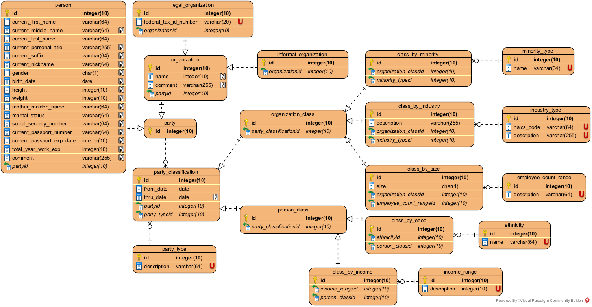
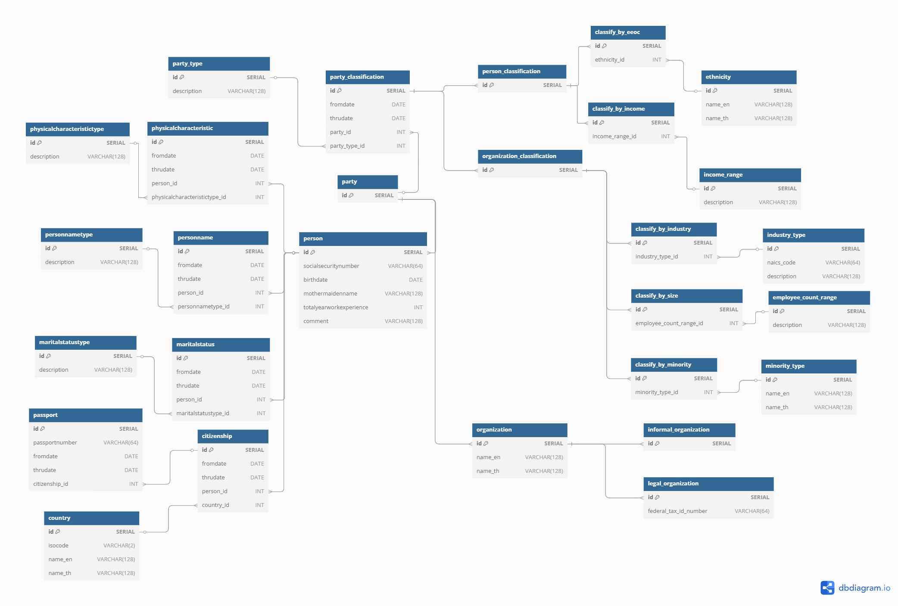
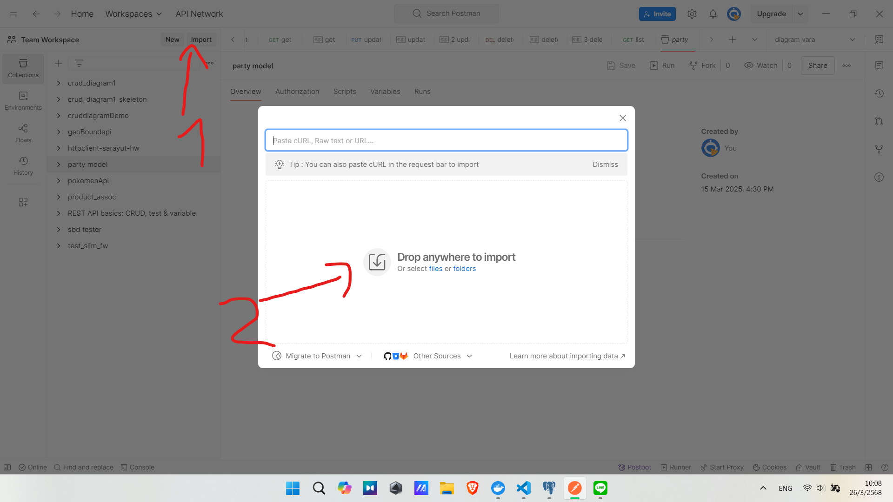
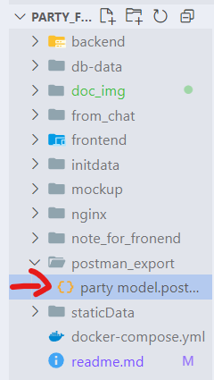

# about this project

project นี้คือ project fullstack base on reference datamodel จาก หนังสือ data model resource book vol1


person alternative


party alternative


party alt + person alt model (จะทำตัวนี้)

# ปัญหาที่เจอจาก framework ตัวเก่า

เดิมถ้าเป็น laravel ตอน run บน window11 . . . backend จะช้ามาก response time 4-5 วินาที 

ปัญหาเรื่อง spec computer ต่ำ ตัดทิ้งได้เลย เพราะคอมผมคือ tuf gaming a15 fa507nu 
- AMD Ryzen 7 7735hs
- 16gb ram DDR5
- 1tb ssd m.2 nvme Lexar NM710 readwrite 5000MB/s
- GPU RTX 4050


ผมตรวจสอบ ปัญหามากมาย เเละคิดว่าประเด็นที่มีผลมากที่สุดคือ docker engine ต้องพึ่งพา wsl2 ในการ run container

พอผมรู้ว่ามันช้าที่ wsl2 ผมเลย optimize wsl2 ไปปลด lock ให้ทำงานเต็มที่กว่าเดิม (รายละเอียดใน logbook ส่ง อาจารย์)

เเต่พอไป run บน ubuntu เครื่องคอมของ โรงเรียนที่ประสิทธิภาพต่ำกว่าคอมผมมากๆ response time กลับเร็วขึ้น เป็น 2-3 วินาที เพราะไม่ต้องผ่าน wsl2 สามารถทำงานบน ubuntu ได้โดยตรง เเต่ก็ยังถือว่าช้าอยู่ดี ผมเลยเปลี่ยนไปใช้ slim framework เเทน

[link to my github](https://github.com/ssszZ-TH/geo_boundary_fullstack_docker)

สำหรับคนที่อยากทดสอบ ว่า ตัวเก่า performance เป็นอย่างไร สามารถ ทำตามดังนี้ได้เลย

```bash

git clone https://github.com/ssszZ-TH/geo_boundary_fullstack_docker.git

docker compose up -d --build
```

# วิธีเเก้

เปลี่ยนจาก laravel ลดลงเหลือเเค่ slim framework นีคือผลการ benchmark crud service เเบบ auto ด้วย program postman 


# want to test backend



open postman import box



drag this file to postman import box